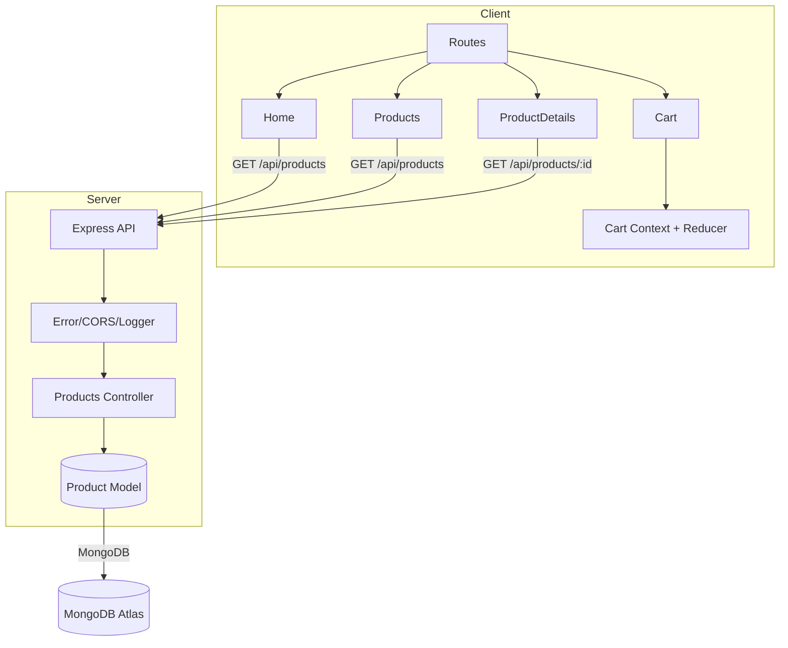
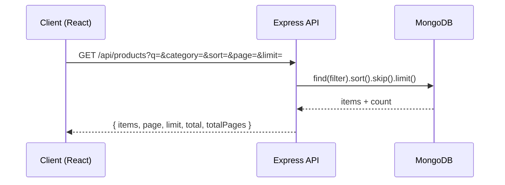

# Architecture Overview

- Scope: browse, details, cart persisted in localStorage. No auth/checkout.
- Tech: React + Vite + Tailwind; Express + MongoDB (Mongoose).

## Component Diagram

## Sequence: Request Flow

## Data Model
- Product: _id, name, description, price, images[], category, rating, stock, createdAt, updatedAt

## Pagination/Filtering
- Query params: q (name regex), category, sort in {price_asc, price_desc, rating_desc}, page, limit
- Defaults: page=1, limit=12; max limit=50

## State Management
- CartContext + useReducer. Persisted to localStorage. Derived subtotal and item count.

## Error Handling
- JSON: { message, code? }. 404 + error handlers.

## Performance
- Cache-Control: /products responses cached 60s. Pagination for scalable lists.
