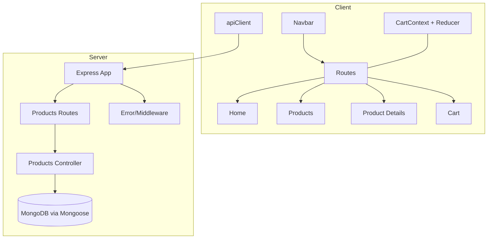
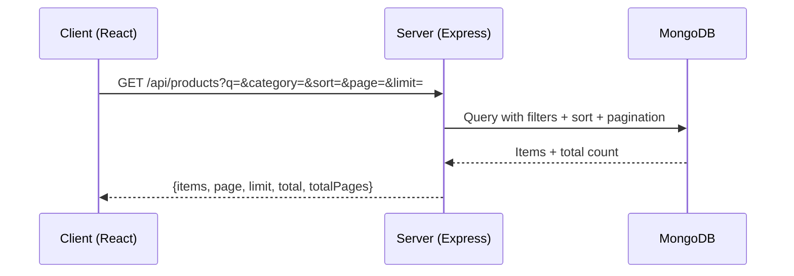

# Architecture

## Overview
A minimal e-commerce app: browse products, view details, and manage a cart persisted in localStorage. No auth or checkout.

## Scope & Non-goals
- Browse products, view details, manage cart
- No authentication, checkout, or payments

## Tech Choices & Rationale
- React + Vite + TypeScript for fast DX and type safety
- Tailwind CSS for rapid, consistent styling
- React Router v6 for routing
- Context + useReducer for simple, explicit cart state
- Express + Mongoose for straightforward REST API and MongoDB ODM

## High-level Component Diagram

## Request Flow (Client → API → DB)

## Data Model
- Product: name, description, price, images[], category, rating (0–5), stock, timestamps

## Pagination & Filtering
- Query params: q, category, sort(price_asc|price_desc|rating_desc), page, limit
- Defaults: page=1, limit=12; include `Cache-Control` on list responses

## State Management
- CartContext + useReducer with actions: ADD_ITEM, REMOVE_ITEM, CHANGE_QTY, CLEAR_CART
- Persist to localStorage and hydrate on app start
- Derived totals: subtotal and item count

## Error Handling Strategy
- JSON shape: {message, code?}
- 404 handler and centralized error handler

## Performance Notes
- Pagination defaults to limit=12
- Basic HTTP caching headers on /products list
